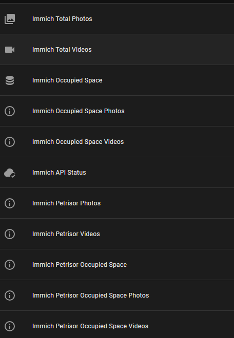

# ha-immich

# Immich Home Assistant Integration

This is a custom integration for Home Assistant that allows you to monitor Immich statistics directly in Home Assistant.

## Installation

1. **Copy** the `ha-immich` folder to your Home Assistant `custom_components` directory.
2. **Restart** Home Assistant.
3. **Add** the Immich integration from `Settings` → `Devices & Services` → `Add Integration` and search for `Immich`.
4. **Enter** your Immich server URL, API key, and scan interval.

## Requirements
- Home Assistant (core or OS)
- A running Immich server
- An API key generated from Immich ([see Immich documentation](https://immich.app/docs/features/api-keys/))

> **ℹ️ This integration requires no extra Python dependencies.**

## Uninstall
- Delete the `custom_components/ha-immich` folder from your Home Assistant setup.
- Restart Home Assistant.

## Support
For issues or questions, open an issue on GitHub or contact the developer.